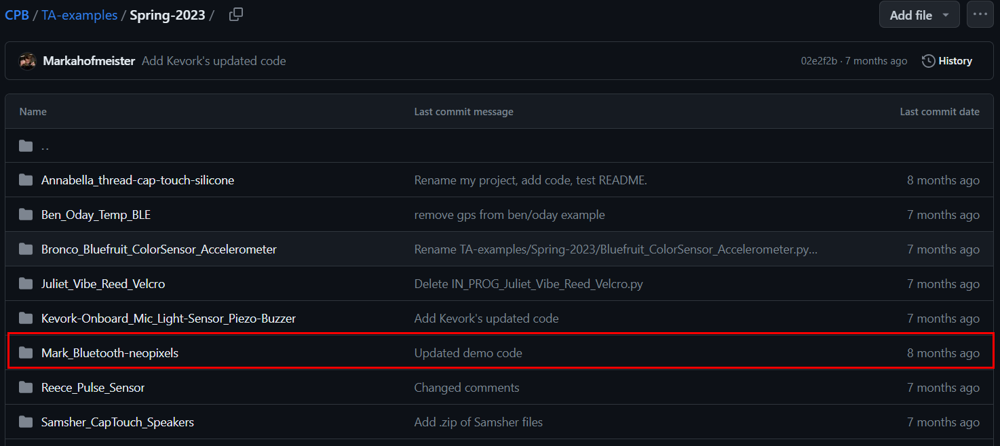
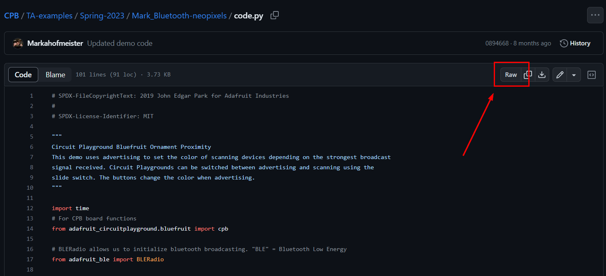

# Directory for Fall 2023 TA Examples

## The link in the description of the YouTube video should be a "Raw" GitHub link. 

As long as your file's name doesn't change, the raw link to your code file will provide users with the most up-to-date version of your code (if it's on GitHub.) Therefore, you can make changes after your video has been released without changing the link in the video description. 

## To obtain a raw link, follow these steps:

I'll use mine from Spring 2023 as an example. 

1. **Click on your Demo Project's Appropriate Directory**
   

2. **Upload your Demo Project Code to the Appropriate Directory**

3. **Click into the .py File that you've just Uploaded and Click the "Raw" Button**

4. **Copy the Raw Code Link into the description of your YouTube video**

